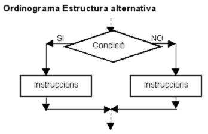
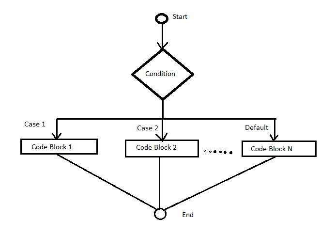

# Estructures condicionals

[Code.org](http://www.code.org)

[Eina per fer diagrames de flux: diagrams](https://app.diagrams.net/)

## Condicional doble

La part lògica de l'ALU (la unitat aritmètico-lògica del processador) dota l'ordinador de la capacitat de prendre decisions. Això s'implementa en llenguatge algorísmic mitjançant la contrucció **si-llavors-sinó**. La decisió s'especifica en una expressió lògica, la qual ha d'avaluar a cert (*true*) o fals (*false*).



```
si		"condició"
llavors	"alternativa certa"
[sino	"alternativa falsa"]
[fi_si]
```
L'expressió de la condició pot utilitzar els operardors relacionals i lògics.

**Operadors relacionals**

>		Major que
<		Menor que
=		Igual a
≥		Major que o igual a
≤		Menor que o igual a
≠		Diferent de

**Operadores lògics**

AND (Y), OR (O), NOT (NO)

Les estructures condicionals es poden **enniuar**, es a dir, que una de les branques pot contenir una altra estructura condicionals si és necessari.


## Condicional múltiple

Quan la condició a avaluar pot prendre més de dos valors, s'utilitza el condicional múltiple.


