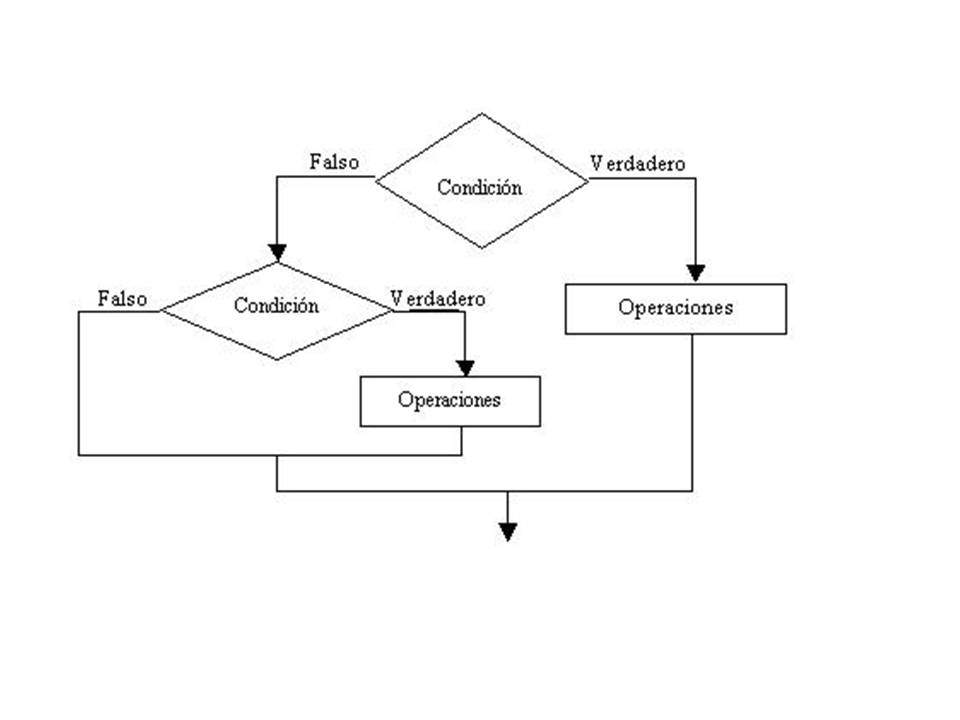

# Estructures condicionals

## Introducció

[Eina per fer diagrames de flux: diagrams](https://app.diagrams.net/)

Les sentències condicionals contenen instruccions que es poden executar o no en funció del valor d'una condició.

En funció del nombre de branques de codi, es poden classificar en:

* condicional simple
* condicional doble
* condicional múltiple

## Condicional simple

Només una branca de codi amb execució opcional. Si es compleix la condició, s'executa el bloc de codi, si no es compleix, no s'executa cap instrucció del condicional i el control passa a la instrucció que segueix l'estructura. 

Es un cas simplificat del condicional doble.

L'expressió de la condició pot utilitzar els operadors relacionals i lògics.

**Operadors relacionals**

>		Major que
<		Menor que
=		Igual a
≥		Major que o igual a
≤		Menor que o igual a
≠		Diferent de

**Operadores lògics**

AND (Y), OR (O), NOT (NO)

## Condicional doble

La part lògica de l'ALU (la unitat aritmètico-lògica del processador) dota l'ordinador de la capacitat de prendre decisions. Això s'implementa en llenguatge algorísmic mitjançant la contrucció **si-llavors-sinó**. La decisió s'especifica en una expressió lògica, la qual ha d'avaluar a cert (*true*) o fals (*false*).


```
si		"condició"
llavors	"alternativa certa"
[sino	"alternativa falsa"]
[fi_si]
```
Les estructures condicionals es poden **enniuar**, es a dir, que una de les branques pot contenir una altra estructura condicionals si és necessari.



## Condicional múltiple

Quan la condició a avaluar pot prendre més de dos valors, s'utilitza el condicional múltiple.


*Exemples*

```java
import java.util.Scanner;
/**
 * Llegeix el número de dia de la setmana i 
 * mostra el dia de la setmana
 * @author Jose
 */
public class DiaSetmana {
    public static void main(String[] args) {
        Scanner lector = new Scanner(System.in);
        //llegir número de l'1 al 7 (dia de la setmana)
        System.out.print("Entra el dia de la setmana: ");
        int dia = lector.nextInt();
        System.out.println("Has entrat el dia: " + dia);
        //mostrar dia de la setmana
        switch (dia) {
            case 1: 
                System.out.println("Oh, avui és dilluns");
                break;
            case 2: 
                System.out.println("Avui és dimarts");
                break;
            case 3:
                System.out.println("Avui és dimecres");
                break;
            case 4:
                System.out.println("Avui és dijous");
                break;
            case 5:
                System.out.println("Avui és divendres. Hurra!, demà serà dissabte");
                break;
            case 6:
                System.out.println("Avui és dissabte");
                break;
            case 7:
                System.out.println("Avui és diumenge. Ohh! demà serà dilluns");
                break;
            default:
                System.out.println("Número de dia incorrecte");
                break;
        }   
    }
}
```

```java
import java.util.Scanner;
/**
 * Llegeix qualificació i mostra comentari
 * @author Jose
 */
public class Qualificacio {
    public static void main(String args[]) {
        Scanner lector = new Scanner(System.in);
        //llegir la qualificació
        System.out.print("Entra la teva qualificació: ");
        char qualificacio = lector.next().toUpperCase().charAt(0);
        //mostrar la qualificació entrada
        System.out.println("La teva qualificació és " + qualificacio);
        //mostrar comentari
        switch (qualificacio) {
            case 'A':
                System.out.println("Excel·lent!");
                break;
            case 'B':
            case 'C':
                System.out.println("Ben fet!");
                break;
            case 'D':
                System.out.println("Has aprovat");
            case 'F':
                System.out.println("Torna-ho a intentar");
                break;
            default:
                System.out.println("Qualificació no vàlida");
        }
    }
}
```

```java
import java.util.Scanner;
/**
 * Calculadora aritmètica senzilla
 * @author Jose
 */
public class CalculadoraSenzilla {
    public static void main(String[] args) {
        Scanner lector = new Scanner(System.in);
        //llegir 1r operand
        System.out.print("Entra el primer operand: ");
        int operand1 = lector.nextInt();
        //llegir 2n operand
        System.out.print("Entra el segon operand: ");
        int operand2 = lector.nextInt();
        //llegir operador
        System.out.print("Entra l'operador: ");
        char operador = lector.next().charAt(0);
        //mostrar expressió a avaluar
        System.out.format("Expressió a avaluar: %d %c %d\n",
            operand1, operador, operand2);      
        int result=0;  //resultat de l'operació
        String missatge;  //missatge a mostrar
        //calcular
        switch (operador) {
            case '+':
                result = operand1 + operand2;
                missatge = "resultat: "+result;
                break;
            case '-':
                result = operand1 - operand2;
                missatge = "resultat: "+result;
                break;
            case '*':
                result = operand1 * operand2;
                missatge = "resultat: "+result;
                break;
            case '/':
                result = operand1 / operand2;
                missatge = "resultat: "+result;
                break;
            default:
                missatge = "operació no vàlida";
                break;
        }
        //mostrar resultat
        System.out.println(missatge);      
    } 
}
```
