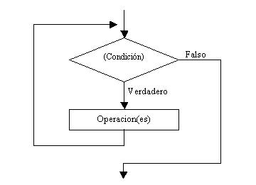

# Estructures iteratives

[Eina per fer diagrames de flux: diagrams](https://app.diagrams.net/)

## Introducció

Els ordinadors estan especialment dissenyats per a les aplicacions en les quals una operació o una sèrie s'han de repetir moltes vegades. La construcció de programació corresponent a aquest cas és el llaç o el **bucle**.

Els bucles es poden classificar en funció de la condició de sortida del mateix de dues maneres:

  - Bucles condicionals.
  - Bucles comptats.

## Bucles condicionals

El bloc de codi a repetir s'executa mentres que se satisfà una certa condició. Quan la condició és falsa, se surt del bucle i es continua executant la següent instrucció que segueix.

A cada iteració (repetició) s'avalua novament la condició. En funció del moment en què s'avalua la condició de manteniment del bucle es classifiquen en:

  - Bucles condicionals provats a l'inici
  - Bucles condicionals provals al final

### Bucle condicional provat a l'inici (while)

La condició s'avalua abans d'executar el bloc intern. Per tant, si la condició no es compleix, el codi del bucle no s'executa cap vegada.

### Bucle condicional provat al final (do-while)

La condició s'avalua al final del bloc intern (després de la seva execució). Per tant, sempre s'executa el bloc intern almenys una vegada.

## Bucles comptats (for)

S'utilitzen generalment quan es coneix el nombre de vegades que el bloc del bucle s'ha de repetir. Fan servir un comptador per controlar el nombre d'iteracions.

Els bucles *for* en llenguatge *Java* són molt potents i tenen moltes més possibilitats d´us que l'especificat per al recompte d'iteracions.

## Enniuament de bucles

El codi de l'interior del bucle pot també contenir altres bucles, generant estructures per respondre a problemes complexos.
