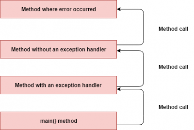

# Control d'excepcions

## Continguts

* Llançament i captura d'excepcions.
* Excepcions del llenguatge.
* Definició de tipus d'excepcions específics.


[Apunts d'excepcions](assets/5.1/5.1.1/dax2_m03-a511-Excepcions.pdf)



## Què són les excepcions

Una excepció (***Exception***) és un esdeveniment que es produeix durant l'execució d'un programa.

L'excepció constitueix un flux alternatiu al flux principal del programa, el qual tracta una situació que no és l'habitual.

La principal utilitat de les excepcions és el tractament d'errors. Quan es produeix un error durant l'execució d'unprograma, l'aplicació llança (***throws***) una excepció, la qual ha de ser capturada i tractada (***catch***) en algun lloc del codi. Les linies de codi que poden produir excepcions han d'anar tancades en un bloc ***try***.

Els errors i les excepcions en Java es representen amb les classes [***Error***](https://docs.oracle.com/en/java/javase/17/docs/api/java.base/java/lang/Error.html) i [***Exception***](https://docs.oracle.com/en/java/javase/17/docs/api/java.base/java/lang/Exception.html), les quals deriven de la classe [***Throwable***](https://docs.oracle.com/en/java/javase/17/docs/api/java.base/java/lang/Throwable.html). La classe *Error* respon a errors de la màquiona virtual de Java. Per als errors del codi Java, s'utilitza la classe *Exception* i les seves classes derivades.

## Captura d'excepcions

A continuació es descriu el procediment de programació amb excepcions.

El fragment de codi sospitós de generar una excepció es tanca dintre d'un bloc **try {}**, el qual és seguit d'un o més blocs **catch {}** i, opcionalment, un bloc **finally {}**.

Dintre d'un segment *try* es poden llançar diverses excepcions, identificades pel seu tipus. Cada bloc *catch* captura un tipus d'excepció i hi dóna el tractament específic desitjat.

El bloc *finally* defineix codi que s'ha d'executar per a qualsevol flux del programa, tant si s'ha llançat alguna excepció com si no.

Quan es llança una excepció en algun punt d'un bloc *try* (la qual cosa pot passar dintre d'un mètode invocat dintre del bloc), no s'executa cap instrucció posterior del bloc i l'execució passa al bloc *catch* corresponent a l'excepció que s'ha llançat.

```java
try {
    //codi que pot generar una excepció
} catch (tipus_excepcio ident) {
    //codi per tractar l'excepció
}
```

```java
try {
    //codi que pot generar una excepció
} catch (tipus_excepcio ident) {
    //codi per tractar l'excepció
} finally {
    //bloc opcional que s'executa en qualsevol situació
}
```

```java
try {
    //codi que pot generar una excepció
} catch (tipus_excepcio1 ident) {
    //codi per tractar l'excepció de tipus 1
} catch (tipus_excepcio2 ident) {
    //codi per tractar l'excepció de tipus 2
} finally {
    //bloc opcional que s'executa en qualsevol situació
}
```

```java
try {
    //codi que pot generar una excepció
} catch (tipus_excepcio1 | tipus_excepcio2 ident) {
    //codi per tractar les excepcions de tipus 1 i 2
} finally {
    //bloc opcional que s'executa en qualsevol situació
}
```

```java
try {
    //codi que pot generar una excepció
} catch (Exception ident) {
    //codi per tractar totes les excepcions, ja que totes hereten de Exception
} finally {
    //bloc opcional que s'executa en qualsevol situació
}
```

## Excepcions verificades (checked) i no verificades (unchecked)

Les excepcions que poden ser llançades en temps de compilació s'anomenen ***checked exceptions***. Han de ser obligatòriament gestionades pel codi,la qual cosa implica que cal escriure blocs try-cath que continguin l'execució on poden ser llançades i cal declarar-les al prototip dels mètodes a l'interior dels quals es puguin produir i que no les capturin. Totes hereten de ***Exception***.

Les excepcions que es poden produir en qualsevol moment en temps d'execució es diuen ***unchecked exceptions***. Els mètodes no estan obligats a capturar-les ni declarar explícitament que les llancen. Totes hereten de ***RuntimeException***.

[Jerarquia de les excepcions en Java](assets/5.1/5.1.1/exception-call_stack.png)

[Exemple de captura d'excepcions en el mateix mètode](assets/5.1/5.1.1/Exception1.java)

[Exemple de captura d'excepcions en diferent mètode](assets/5.1/5.1.1/Exception2.java)

[Exemple de captura de múltiples excepcions](assets/5.1/5.1.1/Exception3.java)

[Exemple de llançament d'excepcions](assets/5.1/5.1.1/Exception4.java)

## Definició d'excepcions

Derivant de la classe Exception podem definir nous tipus d'excepcions que responguin a les circumstàncies que es produeixin en el nostre codi.

Cal redefinir algun dels constructors de la classe **Exception**, per exemple, el que rep un missatge informatiu.

**Constructors** de la classe *Exception* (homòlegs als de *Throwable*):
```java
Exception()
Exception(String message)
Exception(String message, Throwable cause)
Exception(Throwable cause)
```

### Exemple de definició d'excepcions per al càlcul de les solucions d'una equació de 2n grau

El següent exemple il·lustra el procediment per calcular les solucions d'una equació de 2n grau *ax2+bx+c=0*, la qual s'encapsula amb la classe *Eq2nGrau*.

El mètode solucionar(), de la classe Eq2nGrau, pot llançar dues excepcions específiques del càlcul: 

  * PrimerGrauException: quan a=0, no es pot aplicar la fórmula de 2n grau
  * CapSolucioException: quan el discriminant és negatiu i no hi ha solucions reals

La definició de les excepcions específiques es fa estenent de la classe Exception.

```java
public class PrimerGrauException extends Exception {
    public PrimerGrauException(String s) {
        super(s);
    }
}
```

```java
public class CapSolucioException extends Exception {
    public CapSolucioException(String s) {
        super(s);
    }
}
```

Ara ja podem utilitzar les noves excepcions quan calgui llançar-les:

```java
if (a=0) {
    throw new PrimerGrauException("a=0. L'equació és de primer grau");
}
```

Com que el mètode solucionar() no captura al seu interior les excepcions, sinó que les passa cap al mètode que l'havia invocat, cal incloure al seu prototip la declaració de les excepcions que pot llançar.

```java
public void solucionar() throws PrimerGrauException, CapSolucioException {
    //...
}
```

[Exemple de definició d'excepcions](assets/5.1/5.1.1/Eq2nGrauTest.java). Il·lustra la resolució d'equacions de segon grau definint excepcions per als casos que no hi ha solució i es poden produir errors.

[Exemple d'ús d'excepcions per a mantenir la coherència de les dades: Classe Person](assets/5.1/5.1.1/Person_with_exceptions.zip)
